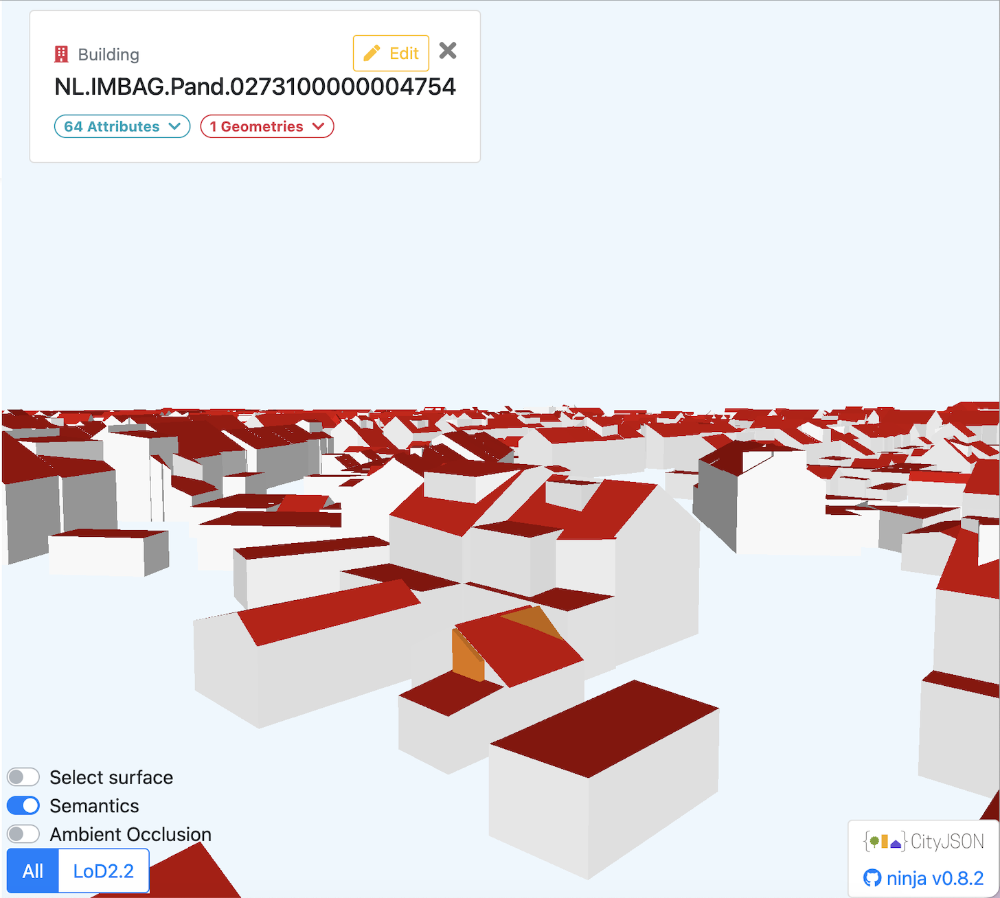
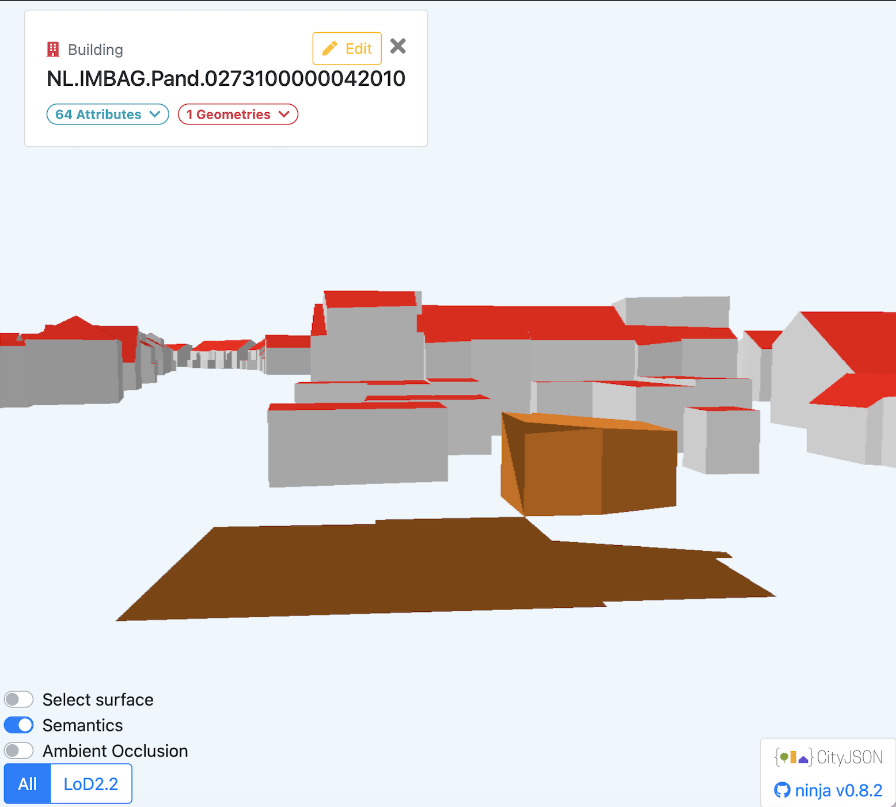

e# CityJSON Building Processing with CGAL

A C++ application for processing 3D building models stored in the CityJSON format. The project operates and outputs an LoD2.2 building geometries from the 3DBAG dataset and performs geometry simplification, constrained triangulation, volume, and roof area computation before exporting a valid CityJSON file.

## Contributors

* Julia Fossa Marques
* Belina Aileen Santoso

<table>
  <tr>
    <td align="center">
      <br>
      <b>invalid self-intersecting..</b>
    </td>
    <td align="center">
      <br>
      <b>invalid 3D geom, non-watertight...</b>
    </td>
  </tr>
</table>

## Features

- Extracts and preserves only LoD2.2 building geometries and merging of `BuildingPart` children objects into their parent `Building`.
- Triangulates polygonal surfaces while preserving semantic information.
- Computes building volumes using signed volume computation.
- Calculates the total roof surface area from semantic `RoofSurface` objects.
- Exports a valid CityJSON 2.0 model enriched with computed attributes.

## Processing Pipeline

### 1. LoD2.2 Extraction

The application removes all Levels of Detail except LoD2.2. The remaining geometry is transferred from each `BuildingPart` to its parent `Building`, simplifying the object hierarchy.

### 2. Surface Triangulation

Each polygonal surface is triangulated without relying on CGAL's built-in triangulation function.

The implemented workflow:

1. Compute the best-fitting plane for each polygon via PCA.
2. Project polygon vertices into 2D via the plane. 
3. Perform a constrained triangulation.
4. Identify interior triangles using the odd-even rule.
5. Extract the interior triangles back to 3D using the plane’s to_3d()

Consistent orientation must be preserved while validity should also be maintained; this is especially important for meshes with holes, in which orientation (CCW) must be opposite of outer envelope orientation (CW)

### 3. Building Volume

Building volume is computed via the signed volume calculation for 3D mesh as tetrahedron is formed by each surface triangle and a chosen fixed reference point.

The calculated value is stored as:

```
geo1004_volume
```

### 4. Roof Surface Area

All semantic surfaces labelled `RoofSurface` are identified, and their combined surface area is calculated.

The result is stored as:

```
geo1004_total_roof_area
```

## Technologies

* C++17
* CGAL
* nlohmann/json
* CMake

## Project Structure

```
├── cpp
│   ├── src
│   │   ├── main.cpp
│   │   └── main.h
│   ├── include
│   │   └── json.hpp
│   ├── validation.md
│   ├── validate_cityjson.py
│   ├── CMakeLists.txt
│   └── README.md
├── data
│   ├── nextbk_2b.city.json
│   └── 9-284-556_out.city.json
├── img
│   ├── a.png
│   ├── b.png
│   ├── c.png
│   └── output.png
└── README.md
```

## Building

Clone repository and go to the C++ project directory:

```bash
cd cpp
mkdir build
cd build
cmake ..
make
```

## Usage

Run executable by providing a CityJSON file as input:

```bash
./cityjson_processor path/to/input.city.json
```

The outputted model is written to the same directory as the input file, with an addition `_out` appended to the filename

Example:

```
9-284-556.city.json
becomes
9-284-556_out.city.json
```

## Dataset

This project is designed to process building models from the 3DBAG dataset, an open dataset containing detailed 3D models of buildings throughout the Netherlands stored in the CityJSON format.

## Output

The generated CityJSON model:

* contains only LoD2.2 geometries and replaces `BuildingPart` objects with their parent `Building`.  Triangulated surfaces are stored as well.
* includes computed building volume,
* includes total roof surface area,
* follows specification of the CityJSON 2.0 specification.

## Acknowledgements

This project was developed in collaboration with Julia Fossa Marques. Her GitHub contributions may not appear in the contribution history because the project was uploaded as a newly created repository by the repository owner.
This repository contains an independently uploaded version from a collaborative academic assignment. However, course-specific materials and submission-related information have been removed for privacy while preserving contributor attribution.
